# Claude Code 命令使用说明

基于 Specification-Driven Development (SDD) 范式的AI出码命令集

## 📋 命令总览

### ⭐ 推荐命令

| 命令 | 说明 | 适用场景 | 大致时间 |
|------|------|---------|---------|
| `/spec.auto` | **一站式智能工作流** | 大多数场景，自动完成完整流程 | 30-80分钟 |

> 💡 **推荐**: 优先使用 `/spec.auto` 命令，它会自动识别当前状态并执行完整工作流。如需精细化控制每个环节，再使用下面的具体命令。

### 📝 分步命令

#### 新功能开发流程

| 命令 | 说明 | 阶段 | 大致时间 |
|------|------|------|---------|
| `/spec.init` | 初始化代码知识库 | 准备阶段 | 5-30分钟 |
| `/spec.feat-prd` | 需求拆分与澄清 | 需求阶段 | 5-15分钟 |
| `/spec.d2c` | Figma设计详情获取 | 设计阶段 | 5-10分钟 |
| `/spec.feat-tech` | 技术方案设计 | 设计阶段 | 3-8分钟 |
| `/spec.code` | 生成项目代码 | 开发阶段 | 5-20分钟 |
| `/spec.test` | 生成测试代码 | 测试阶段 | 3-10分钟 |
| `/spec.review` | 代码审查 | 审查阶段 | 5-15分钟 |
| `/spec.archive` | 归档与知识库更新 | 归档阶段 | 2-5分钟 |

> 💡 **Figma 集成说明**: 在 `/spec.feat-prd` 提供 Figma 链接时会询问是否立即拆分页面,拆分后可在 `/spec.d2c` 中获取设计详情

#### Bug 修复流程

| 命令 | 说明 | 适用场景 | 大致时间 |
|------|------|---------|---------|
| `/spec.bugfix` | Bug 修复工作流 | 修复已知 Bug | 10-30分钟 |

> 📝 `/spec.bugfix` 会引导你描述 Bug、分析原因、设计修复方案并生成代码

> ⏱️ **时间说明**: 实际执行时间取决于项目规模、需求复杂度和代码库大小。`/spec.init` 时间主要受代码库文件数量影响

## 🚀 快速开始

### ⭐ 推荐方式: 使用 `/spec.auto` 一键完成

对于大多数场景，推荐直接使用 `/spec.auto` 命令：

```bash
/spec.auto
```

**`/spec.auto` 会自动**:
1. 检测是否需要初始化知识库（首次使用时）
2. 收集需求信息（PRD、Figma 等）
3. 拆分和澄清需求
4. 设计技术方案
5. 生成代码
6. 生成测试
7. 执行代码审查
8. 归档和更新知识库

> 💡 **优势**: 无需记忆多个命令，自动识别当前进度，智能续传

### 📝 精细化控制: 使用分步命令

如果你需要在每个环节做精细调整，或者只想执行某个特定步骤，可以使用下面的分步命令：

### 1. 首次使用 - 初始化 ⏱️ 5-30分钟

在项目根目录执行:

```bash
/spec.init
```

这将扫描你的代码库并生成知识库文档到 `.spec/knowledge/` 目录。

> 时间取决于代码库大小和文件数量。小型项目 5-10 分钟，中大型项目可能需要 15-30 分钟

### 2. 开始新需求 ⏱️ 5-15分钟

```bash
/spec.feat-prd
```

然后按照提示:
1. 提供PRD文档(粘贴文本/上传文件/提供链接)
2. 提供Figma设计稿(可选)
3. 回答AI的澄清问题

> 时间取决于需求复杂度和澄清问题数量

### 3. 设计技术方案 ⏱️ 3-8分钟

```bash
/spec.feat-tech
```

AI会:
1. 询问项目类型(新项目/迭代项目)
2. 生成技术方案概要
3. 梳理具体改动点
4. 与你确认方案

> 时间取决于技术方案复杂度和改动点数量

### 4. 生成代码 ⏱️ 5-20分钟

```bash
/spec.code
```

AI会根据技术方案自动生成所有代码文件。

> 时间取决于文件数量和代码复杂度,简单功能 5 分钟,复杂功能可能需要 20 分钟

### 5. 生成测试 ⏱️ 3-10分钟

```bash
/spec.test
```

AI会为生成的代码编写单元测试和组件测试。

> 时间取决于测试用例数量和复杂度

### 6. 代码审查 ⏱️ 5-15分钟

```bash
/spec.review
```

AI会启动多个审查Agent并行审查代码的规范性、安全性和性能。

> 时间取决于代码量和审查维度,多Agent并行执行

### 7. 归档 ⏱️ 2-5分钟

```bash
/spec.archive
```

AI会生成归档总结并更新代码知识库。

> 快速归档,更新知识库为下次迭代做准备

## 📁 目录结构

执行命令后会自动生成以下目录结构:

```
项目根目录/
├── .claude/
│   ├── commands/              # 命令定义
│   │   ├── init.md
│   │   ├── feat-prd.md
│   │   ├── feat-tech.md
│   │   ├── code.md
│   │   ├── test.md
│   │   ├── review.md
│   │   └── archive.md
│   └── README.md              # 本文件
│
└── .spec/                 # 工作流数据
    ├── README.md              # 工作流主文档
    ├── docs/                  # 文档目录
    │   ├── 快速启动指南.md
    │   ├── 命令使用速查表.md
    │   └── AI出码方案-PRD到出码全流程.md
    ├── knowledge/             # 代码知识库
    │   ├── components.md
    │   ├── apis.md
    │   ├── functions.md
    │   ├── pages.md
    │   ├── coding-standards.md
    │   └── architecture.md
    │
    └── feature/               # 需求记录
        └── {YYYY-MM-DD}/      # 按日期组织
            ├── README.md
            ├── prd/
            ├── tech/
            ├── code-generation-report.md
            ├── test-report.md
            └── code-review/
```

## 🔄 完整工作流

### 🏗️ 系统架构图

```mermaid
graph TB
    subgraph "用户层"
        User([开发者])
    end

    subgraph "命令层 - Claude Code Commands"
        Auto["'/spec.auto'<br/>智能自动化工作流"]
        Bugfix["'/spec.bugfix'<br/>Bug修复工作流"]

        subgraph "分步命令"
            Init["'/spec.init'<br/>初始化知识库"]
            PRD["'/spec.feat-prd'<br/>需求拆分澄清"]
            Tech["'/spec.feat-tech'<br/>技术方案设计"]
            Code["'/spec.code'<br/>代码生成"]
            Test["'/spec.test'<br/>测试生成"]
            Review["'/spec.review'<br/>代码审查"]
            Archive["'/spec.archive'<br/>归档"]
        end

        subgraph "辅助命令"
            Status["'/spec.status'<br/>查看进度"]
            MultiProj["'/spec.multi-project'<br/>多项目协同"]
            ApiDiff["'/spec.api-diff'<br/>接口变更检测"]
            Progress["'/spec.utils.progress'<br/>进度管理"]
        end
    end

    subgraph "数据层 - .spec/"
        subgraph "知识库 - knowledge/"
            KB1["components.md<br/>组件库"]
            KB2["apis.md<br/>API文档"]
            KB3["functions.md<br/>函数库"]
            KB4["architecture.md<br/>架构文档"]
            KB5["coding-standards.md<br/>编码规范"]
        end

        subgraph "工作流数据 - feature/"
            WF1["prd/<br/>需求文档"]
            WF2["tech/<br/>技术方案"]
            WF3["code-generation/<br/>代码生成"]
            WF4["test/<br/>测试"]
            WF5["code-review/<br/>审查报告"]
            WF6[".meta/<br/>进度&元数据"]
        end

        subgraph "Bug修复数据 - bugfix/"
            BF1["analysis/<br/>问题分析"]
            BF2["solution/<br/>修复方案"]
            BF3["fix-report/<br/>修复报告"]
            BF4[".meta/<br/>进度&元数据"]
        end
    end

    subgraph "代码库"
        Codebase["项目源码<br/>src/, pages/, etc."]
    end

    %% 用户交互
    User -->|执行命令| Auto
    User -->|执行命令| Bugfix
    User -->|执行命令| Init
    User -->|执行命令| PRD
    User -->|查看进度| Status

    %% Auto 工作流编排
    Auto -.智能编排.-> Init
    Auto -.智能编排.-> PRD
    Auto -.智能编排.-> Tech
    Auto -.智能编排.-> Code
    Auto -.智能编排.-> Test
    Auto -.智能编排.-> Review
    Auto -.智能编排.-> Archive

    %% 命令依赖关系
    Init -->|扫描并生成| KB1
    Init -->|扫描并生成| KB2
    Init -->|扫描并生成| KB3
    Init -->|扫描并生成| KB4
    Init -->|扫描并生成| KB5

    PRD -->|读取| KB5
    PRD -->|生成| WF1

    Tech -->|读取| KB1
    Tech -->|读取| KB2
    Tech -->|读取| WF1
    Tech -->|生成| WF2

    Code -->|读取| KB4
    Code -->|读取| WF2
    Code -->|生成| WF3
    Code -->|修改/新增| Codebase

    Test -->|读取| WF3
    Test -->|生成| WF4
    Test -->|生成测试文件| Codebase

    Review -->|读取| Codebase
    Review -->|读取| KB5
    Review -->|生成| WF5

    Archive -->|读取| WF1
    Archive -->|读取| WF2
    Archive -->|读取| WF3
    Archive -->|更新| KB1
    Archive -->|更新| KB2
    Archive -->|更新| KB3

    %% Bugfix 工作流
    Bugfix -->|生成| BF1
    Bugfix -->|生成| BF2
    Bugfix -->|生成| BF3
    Bugfix -->|修改| Codebase
    Bugfix -->|更新| KB1

    %% 进度管理
    Auto -.保存进度.-> WF6
    Bugfix -.保存进度.-> BF4
    Progress -.管理.-> WF6
    Progress -.管理.-> BF4
    Status -->|读取| WF6
    Status -->|读取| BF4

    %% 多项目支持
    MultiProj -->|协调| Tech
    MultiProj -->|协调| Code

    %% 样式
    classDef userStyle fill:#667eea,stroke:#5a67d8,color:#fff
    classDef autoStyle fill:#48bb78,stroke:#38a169,color:#fff
    classDef stepStyle fill:#ed8936,stroke:#dd6b20,color:#fff
    classDef utilStyle fill:#9f7aea,stroke:#805ad5,color:#fff
    classDef kbStyle fill:#4299e1,stroke:#3182ce,color:#fff
    classDef wfStyle fill:#ecc94b,stroke:#d69e2e,color:#000
    classDef codeStyle fill:#f56565,stroke:#e53e3e,color:#fff

    class User userStyle
    class Auto,Bugfix autoStyle
    class Init,PRD,Tech,Code,Test,Review,Archive stepStyle
    class Status,MultiProj,ApiDiff,Progress utilStyle
    class KB1,KB2,KB3,KB4,KB5 kbStyle
    class WF1,WF2,WF3,WF4,WF5,WF6,BF1,BF2,BF3,BF4 wfStyle
    class Codebase codeStyle
```



**架构说明**:

- **命令层**: 三类命令协同工作
  - 🤖 **自动化工作流** (`/spec.auto`, `/spec.bugfix`): 一键完成完整流程
  - 📝 **分步命令**: 精细控制每个环节
  - 🔧 **辅助命令**: 进度查看、多项目协同等

- **数据层**: 结构化存储所有工作流数据
  - 📚 **知识库** (`.spec/knowledge/`): 代码库的结构化知识
  - 📁 **工作流数据** (`.spec/feature/`, `.spec/bugfix/`): 需求、方案、报告等
  - 💾 **进度元数据** (`.meta/`): 支持断点续传

- **数据流向**:
  - ⬇️ **读取**: 命令从知识库和工作流数据中读取信息
  - ⬆️ **生成**: 命令生成新的文档和代码
  - ♻️ **更新**: 归档时更新知识库，保持最新

---

### 🎯 新功能开发

#### ⭐ 方式一: 使用 `/spec.auto` (推荐)

```bash
# 一条命令完成所有流程
/spec.auto
```

AI 会自动执行完整流程，并在需要时暂停等待你的输入或确认。

**流程**:
```
自动识别状态 → PRD收集 → 需求澄清 → 技术方案 → 代码生成 → 测试生成 → 代码审查 → 归档
```

> ⏱️ **总时间**: 30-80 分钟（首次使用含 init 可能需要 35-110 分钟）

---

#### 📝 方式二: 分步执行（精细化控制）

如需在每个环节做详细调整，可使用分步命令：

```
1. /spec.init               # 首次使用,建立知识库              [5-30分钟]
   ↓
2. /spec.feat-prd           # 新需求: 处理PRD                 [5-15分钟]
   ↓
3. /spec.feat-tech          # 设计技术方案                    [3-8分钟]
   ↓
4. /spec.code               # 生成代码                       [5-20分钟]
   ↓
5. npm run dev              # 手动: 运行项目检查              [1-3分钟]
   ↓
6. /spec.test               # 生成测试                       [3-10分钟]
   ↓
7. npm test                 # 手动: 运行测试                 [1-2分钟]
   ↓
8. /spec.review             # 代码审查                       [5-15分钟]
   ↓
9. 修复问题                 # 手动: 修复严重问题              [视问题而定]
   ↓
10. /spec.archive           # 归档完成                       [2-5分钟]
```

> ⏱️ **总时间**:
> - 首次使用(含 init): 35-110 分钟
> - 后续迭代(无需 init): 30-80 分钟
> - 以上均不含手动修复时间

---

### 🐛 Bug 修复

#### 使用 `/spec.bugfix` 快速修复

```bash
# 一条命令完成 Bug 修复流程
/spec.bugfix
```

**流程**:
```
Bug 描述 → 问题分析 → 修复方案设计 → 代码修复 → 测试验证 → 归档
```

AI 会引导你：
1. 📝 描述 Bug 现象和复现步骤
2. 🔍 分析问题原因和影响范围
3. 💡 设计修复方案
4. 🔧 生成修复代码
5. ✅ 生成回归测试
6. 📦 归档修复记录

> ⏱️ **总时间**: 10-30 分钟（取决于 Bug 复杂度）

**适用场景**:
- ✅ 已知的 Bug 需要快速修复
- ✅ 测试或生产环境发现的问题
- ✅ 需要完整记录修复过程
- ✅ 需要生成回归测试防止重现

## 💡 使用技巧

### 0. 选择合适的工作方式

**新功能开发 - 优先使用 `/spec.auto`**:
- ✅ 首次使用，不熟悉完整流程
- ✅ 标准需求，无需特殊定制
- ✅ 快速迭代，减少手动操作
- ✅ 相信 AI 的判断和决策

**Bug 修复 - 使用 `/spec.bugfix`**:
- 🐛 生产环境或测试环境发现的 Bug
- 🐛 需要快速定位和修复问题
- 🐛 需要完整的问题分析和修复记录
- 🐛 需要生成回归测试防止问题重现

**精细化控制 - 使用分步命令**:
- 📝 需要在某个环节做详细审查
- 📝 技术方案需要特殊定制
- 📝 想要学习每个环节的细节
- 📝 需要暂停在某个步骤进行团队讨论

> 💡 **建议**:
> - 新功能开发：优先用 `/spec.auto`
> - Bug 修复：优先用 `/spec.bugfix`
> - 熟悉流程后可根据需要选择分步命令

---

### 1. 需求阶段

**提供完整信息**:
- 尽量提供详细的PRD文档
- 如有Figma,务必提供链接
- API文档和数据字典越早提供越好

**积极回答澄清问题**:
- AI的问题都是为了确保理解正确
- 不确定时可以要求AI给出建议

### 2. 技术方案阶段

**明确项目类型**:
- 新项目: AI会使用最新规范
- 迭代项目: AI会遵循现有规范

**提供约束条件**:
- 明确告知必须使用或禁止使用的技术
- 说明特殊的性能或兼容性要求

### 3. 代码生成阶段

**生成后立即检查**:
- 检查关键文件是否正确
- 运行项目看是否能正常启动
- 检查类型错误

**增量修改**:
- 如需调整,直接修改改动点文档
- 重新执行 `/code` 会基于新的改动点生成

### 4. 测试阶段

**提供人工用例**:
- 对于复杂业务逻辑,提供人工编写的测试用例
- AI会基于这些用例生成完整测试

**关注覆盖率**:
- 运行 `npm test -- --coverage` 查看覆盖率
- 核心业务逻辑建议100%覆盖

### 5. 审查阶段

**认真对待严重问题**:
- 🔴 严重问题必须修复
- 🟡 警告问题建议修复
- 🔵 改进建议可选

**可以多次审查**:
- 修复问题后可以重新执行 `/review`
- 直到达到满意的评分

### 6. 归档阶段

**及时归档**:
- 完成需求后立即归档
- 保持知识库最新

**记录经验**:
- 有价值的解决方案会记录到知识库
- 下次遇到类似问题可以快速查找

## ⚙️ 高级用法

### 中途变更需求

如果需求中途有变更:

```bash
# 修改 prd/clarified/ 下的需求文档
# 或添加新的需求文档

/spec.feat-tech  # 重新生成技术方案
/spec.code       # 重新生成代码
```

### 仅更新特定文件

如果只想重新生成某个文件:

1. 编辑对应的改动点文档
2. 执行 `/spec.code`
3. AI会根据更新后的改动点重新生成

### 增加新的命令

可以在 `.claude/commands/` 目录下创建新的 `.md` 文件来定义自定义命令。

文件名即为命令名(不含扩展名)。

## 🐛 常见问题

### Q0: 什么时候用 `/spec.auto`，什么时候用 `/spec.bugfix`？

**A**:
- `/spec.auto`: 用于新功能开发，完整的需求到出码流程
- `/spec.bugfix`: 用于 Bug 修复，快速定位问题并生成修复代码
- 分步命令: 手动控制每个环节，适合需要精细调整的场景
- 建议：新功能用 `/spec.auto`，Bug 修复用 `/spec.bugfix`

### Q1: 知识库什么时候更新?

**A**:
- 首次: 执行 `/spec.init` 初始化
- 增量: 每次执行 `/spec.archive` 归档时自动更新
- 手动: 重大架构变更时手动执行 `/spec.init` 重建

### Q2: 生成的代码不符合预期怎么办?

**A**:
1. 检查技术方案中的改动点是否准确
2. 如有问题,直接编辑改动点文档
3. 重新执行 `/spec.code` 生成代码

### Q3: 如何处理AI未识别的依赖?

**A**:
- 在技术方案阶段明确告知AI
- 在改动点文档中补充说明
- 生成代码后手动添加

### Q4: `/spec.bugfix` 和直接用 `/spec.auto` 有什么区别？

**A**:
- `/spec.bugfix`: 专门为 Bug 修复优化，包含问题分析、根因定位、回归测试生成
- `/spec.auto`: 适合新功能开发，从需求到出码的完整流程
- Bug 修复用 `/spec.bugfix` 更高效，记录更完整

### Q5: 测试生成不够全面怎么办?

**A**:
1. 提供人工编写的测试用例作为输入
2. 在生成的测试基础上手动补充
3. 使用覆盖率工具检查遗漏

### Q6: 如何在团队中使用?

**A**:
- 每个开发者独立执行流程
- `.spec/` 目录可以提交到Git
- 知识库文件建议团队共享
- 个人的feature目录可以独立管理

## 📚 参考文档

- [工作流主文档](../.spec/README.md) - SDD工作流完整介绍
- [快速启动指南](../.spec/docs/快速启动指南.md) - 新手必读
- [命令使用速查表](../.spec/docs/命令使用速查表.md) - 详细命令参考
- [完整方案文档](../.spec/docs/AI出码方案-PRD到出码全流程.md) - 深入理解方案

## 🔧 故障排查

### 命令无法识别

**症状**: 输入命令后没有反应

**解决**:
1. 确认命令文件在 `.claude/commands/` 目录下
2. 确认文件名是 `{command}.md` 格式
3. 重启 Claude Code

### 知识库读取失败

**症状**: AI提示找不到知识库

**解决**:
1. 检查 `.spec/knowledge/` 目录是否存在
2. 执行 `/init` 重新初始化
3. 检查文件权限

### 生成的代码有语法错误

**症状**: 代码无法编译

**解决**:
1. 检查改动点文档中的代码片段是否完整
2. 检查TypeScript配置是否正确
3. 手动修复后可以提供反馈给AI学习

## 📝 更新日志

### v1.0.0 (2025-12-12)
- 🎉 初始版本发布
- ✅ 完整的PRD到出码流程
- ✅ 7个核心命令
- ✅ 自动化代码知识库管理
- ✅ 多Agent并行审查

## 📮 反馈与支持

如有问题或建议,欢迎反馈!

---

**Made with ❤️ by Claude Code + SDD**
